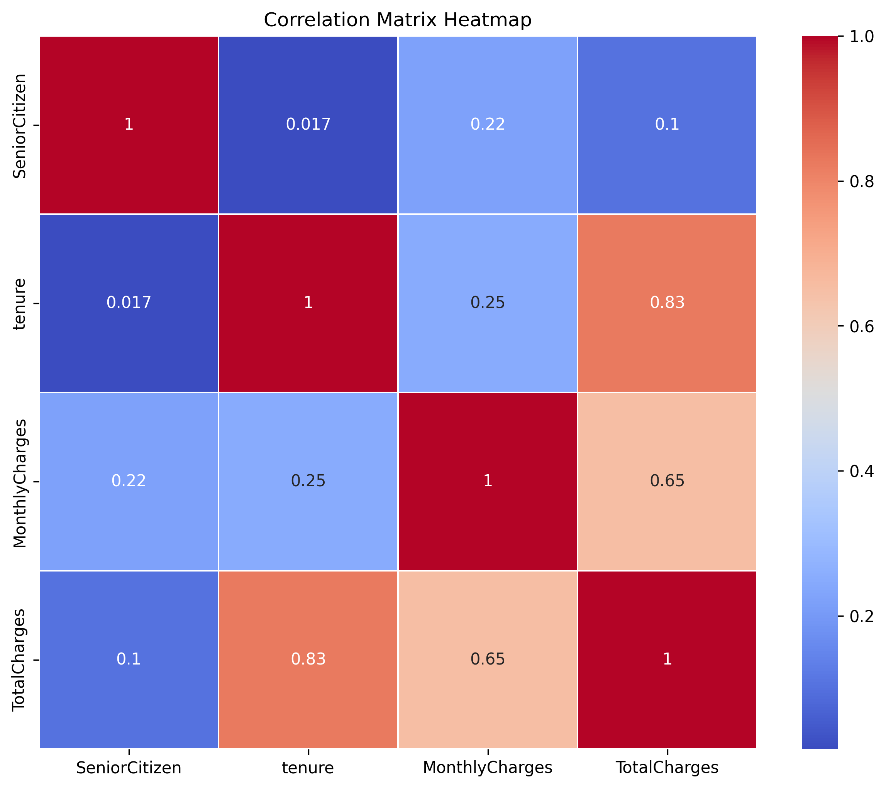

## **Customer Churn Prediction Project Documentation**

#### **1. Introduction**
- **Project Overview**: This project aims to predict customer churn for a telecommunications company using machine learning techniques. Churn refers to customers leaving or unsubscribing from a service, and predicting churn allows businesses to take proactive measures to retain customers.
  
- **Objective**: The goal is to build a model that can predict whether a customer will churn, based on their historical data, service usage, and other factors. This will help the company to improve customer retention strategies.
  
- **Dataset Summary**: The dataset includes various features such as customer demographic information, contract type, internet and phone service usage, and billing details. The target variable is `Churn`, which is binary (1 = Churned, 0 = Not Churned).

---

#### **2. Data Cleaning and Preprocessing**
- **Handling Missing Values**: Missing values were identified and filled appropriately. For example, `TotalCharges`, which had some missing values, was filled with the median of the column.
  
- **Feature Engineering**: A new feature, `AvgChargesPerMonth`, was created by dividing `TotalCharges` by `tenure` to capture the average monthly charges. This helps in understanding the customer’s monthly spending pattern.
  
- **Encoding Categorical Variables**: One-hot encoding was applied to categorical variables (e.g., `Contract`, `PaymentMethod`), converting them into numerical form. This allows the model to handle categorical data effectively.

---

#### **3. Exploratory Data Analysis (EDA)**
- **Initial Data Exploration**: The initial exploration revealed important patterns, such as how features like `tenure` and `contract length` are closely related to churn. Customers with shorter contracts or lower tenure were more likely to churn.
  
- **Visualizations**:
   - **Heatmap**: A correlation heatmap was used to visualize relationships between numerical features like `MonthlyCharges`, `tenure`, and `TotalCharges`.
   - **Boxplots**: Boxplots showed the distribution of key features and identified potential outliers, offering insights into customer behavior.

     
---

#### **4. Multicollinearity Check**
- **Variance Inflation Factor (VIF)**: Multicollinearity was checked using VIF to ensure that highly correlated features were handled. The features `tenure` and `TotalCharges` had higher VIF values, and a new feature `AvgChargesPerMonth` was introduced to mitigate this issue by combining these two features.

---

#### **5. Model Selection and Training**
- **Baseline Model**: A Logistic Regression model was chosen as the baseline because it is simple to interpret and provides good initial results for classification problems like churn prediction.
  
- **Class Imbalance Handling**: The dataset was imbalanced, with fewer churners than non-churners. To address this, we applied **balanced class weights** to give higher importance to churners during model training.
  
- **Feature Selection**: Feature selection was performed using recursive feature elimination (RFE). This helped in identifying the most important features and improving model performance by reducing noise in the data.

---

#### **6. Model Evaluation**
- **Confusion Matrix and Metrics**: The Logistic Regression model achieved a balanced accuracy of **74.24%** with balanced class weights.
   - **Precision for churners**: 0.51
   - **Recall for churners**: 0.82 (indicating that 82% of actual churners were correctly identified).
   - **F1-Score**: 0.63, reflecting a balance between precision and recall.

- **Final Model Performance**: The balanced model showed significant improvement in **recall** for churners, making it more effective in identifying customers who are likely to leave, although precision slightly decreased.

---

#### **7. Interpretation of Results**
- **Feature Contributions**: 
   - The most important features contributing to churn were:
     - **Contract_Two year**: Strongly reduces churn probability (customers on two-year contracts are less likely to churn).
     - **InternetService_Fiber optic**: Increases churn probability (fiber optic customers tend to churn more).
     - **Tenure**: Longer tenure reduces the likelihood of churn.
   
- **Actionable Insights**: 
   - **Focus on long-term contracts**: Offering incentives for customers to switch to two-year contracts could help reduce churn.
   - **Investigate fiber optic service**: Fiber optic customers are more likely to churn, which may indicate dissatisfaction with the service, prompting further investigation.

---

#### **8. Conclusion**
- **Summary of Findings**: The model provides a solid approach to predicting customer churn with a balanced recall for churners, ensuring that the company can effectively identify customers at risk of leaving.
  
- **Next Steps**: Future work could include exploring more advanced models like **Random Forest** or **XGBoost** to further improve performance. Additionally, periodic retraining of the model with new data will help maintain its accuracy.
